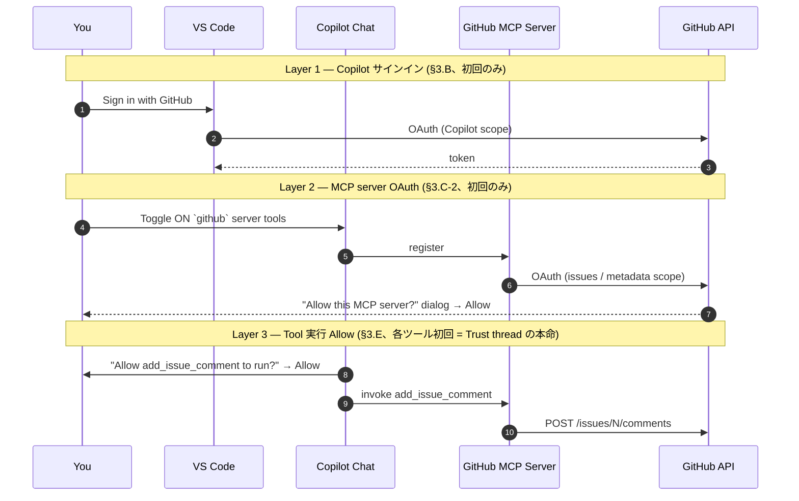
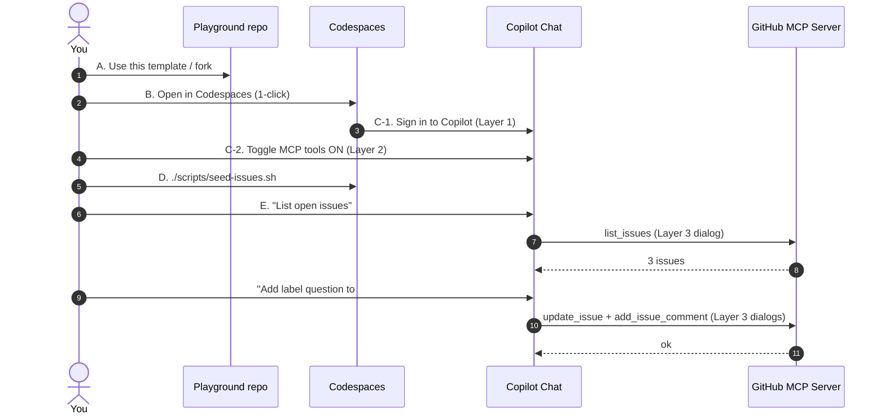

# Step 0 — Setup (Codespaces 起動 / Copilot 認証 / GitHub MCP 接続)

> **必須 Step (MUST、Standard / Full プロファイル)** ・ 対応 Layer: **Layer 0 (MCP)** ・ 体感 ~15 分

> **このステップで何が起きるか (3 行)**
> 1. Codespaces を 1 クリックで起動して、Copilot Chat と **GitHub MCP Server** を繋ぐ。
> 2. seed Issue を 3 件作って、Copilot Chat に「issues を一覧して」と頼む。
> 3. 1 件を選んで **label を付与 + コメント追加** までやらせる ( = mini-triage )。

> [!IMPORTANT]
> **Trust thread (この旅の縦糸)** — Copilot Chat がツールを呼ぶ前に毎回出る「**承認ダイアログ**」は、エージェントに**何を許可するか**を決める瞬間です。Step 0 ではこの UI を 3 回見ることになります。Step 6a (Required Review Gate) で「**人間が最後に握る** judgement」として回収します。
>
> ⚠ Step 0 では認証ダイアログが **3 つの異なるレイヤー** で出ます (Copilot サインイン / MCP server OAuth / 各ツール実行 Allow)。詳しくは §3 冒頭の「認証 3 層モデル」を参照。**すべて Allow してください**。

---

## 1. 学習目標 (Learning Objectives)

このステップを終えると、あなたは:

- ✅ Codespaces が devcontainer から **1 クリックで起動する** ことを体験している
- ✅ Copilot Chat が **GitHub MCP Server** 経由で `list_issues` / `update_issue` / `add_issue_comment` の 3 ツールを呼べることを **目で確認**している
- ✅ ツール呼び出しごとに表示される **承認ダイアログ (Trust UI)** の意味を言葉で説明できる
- ✅ 「Issue 1 件を triage する」という後続 Step の **基本ループ** (list → label → comment) を一度通している

---

## 2. 前提 (Prerequisites)

> [!CAUTION]
> **このリポジトリ (workshop) と、あなたが手を動かすリポジトリ (playground) は別物です。**
> Step 0 から Step 6 まで、あなたは **自分の playground repo** で作業します。**workshop repo (本リポ) を直接編集しないでください。** 取り違え事故を防ぐため、Codespaces を開いたら最初に必ず次のコマンドで「いま自分はどこに居るか」を確認してください:
> ```bash
> gh repo view --json nameWithOwner -q .nameWithOwner
> ```

満たすべき必須条件 (詳細は [`../prerequisites.md`](../prerequisites.md) 「必須環境」):

- GitHub アカウント (個人) を持っている
- GitHub Copilot プラン (Pro / Pro+ / Business / Enterprise) のいずれかが有効
- GitHub Codespaces を使える (Free 枠 60 時間 / 月で完走可能)
- VS Code (Web 版 / Desktop 版どちらでも可) と Copilot Chat 拡張が利用できる

> [!NOTE]
> **PAT (Personal Access Token) は Step 0 では不要**です。Codespaces が VS Code セッションを通じて GitHub に透過認証してくれます。PAT は Step 4 (Automate) で初めて登場します。

---

## 3. 手順 (Steps)

### 3.0 認証 3 層モデル (このセクションの全体像)

Step 0 で出会う **3 種類の認証ダイアログ** をあらかじめ俯瞰しておくと、後で「どこで何を Allow したか」を見失いません。PAT は不要ですが、ダイアログは 0 回ではありません。


<!-- alt: Sequence diagram showing the three authentication layers in Step 0. Layer 1 is the one-time Copilot sign-in. Layer 2 is the one-time OAuth Allow when the learner toggles the GitHub MCP server tools ON. Layer 3 is the per-tool Allow dialog that fires the first time the agent invokes each MCP tool — this is the climax of Step 0 (the Trust thread). PAT is not required at any layer. -->

| Layer | いつ出るか | 何を許可するか | 頻度 | 該当節 |
|---|---|---|---|---|
| **Layer 1** | Codespaces 起動直後 | VS Code → GitHub (Copilot サインイン) | 初回のみ | §3.B |
| **Layer 2** | `github` server を初めて ON にしたとき | MCP server → GitHub API (OAuth スコープ付与) | 初回のみ | §3.C-2 |
| **Layer 3** | Agent が各ツールを初めて呼ぶたび | そのツール (label / comment / list) | 各ツール初回 (★ Trust thread の本命) | §3.E |

> [!TIP]
> Layer 1 と Layer 2 は **通過儀礼**。すべて Allow して進めてください。
> Layer 3 が Step 0 のクライマックスです — どのツールに何を許可しているか、ダイアログ文言を **声に出して読む** くらいのつもりで観察してください。

### 3.A〜3.E — 操作の全体像


<!-- alt: Sequence diagram. The learner creates a playground repo, opens it in Codespaces, signs in to Copilot (Layer 1), toggles MCP tools ON (Layer 2), runs the seed script, and then asks Copilot Chat to list issues, label one issue, and post a comment. Each MCP tool invocation triggers a Layer 3 approval dialog (the Trust thread). -->

### A. Playground repo を用意する (1 回だけ)

[本リポ (workshop)](https://github.com/shinyay/ghcp-6-layer-agentic-platform) のトップで **「Use this template」 → 「Create a new repository」** を選び、自分の名義で playground repo を作ります。

> Use this template が見当たらない場合の代替: 同じ画面の **Fork** を選ぶ。Phase 11 で正式な template リンクが出るまでの暫定で同等に使えます。

> [!NOTE]
> このリポは template 化されているので、**private のままでも** Use this template が動きます (workshop repo を public にする必要はありません)。

### B. Codespaces を起動する (= 認証 Layer 1)

作った **playground repo** の方で、`Code` → `Codespaces` → `Create codespace on main`。

devcontainer が自動で `gh` / `gh aw v0.68.3` / `jq` を入れた状態で起動します (postCreate ログに `gh aw version v0.68.3` が出ていれば OK)。

> 終了確認:
> ```bash
> gh aw version           # → gh aw version v0.68.3
> gh repo view --json nameWithOwner -q .nameWithOwner   # → あなたの playground repo
> ```

VS Code 左下のアカウントアイコン → `Sign in with GitHub to use GitHub Copilot` を選ぶ。
左サイドバーの **Chat** アイコン (吹き出し) を開いて、何でもいいので 1 行打って返事が返れば **認証 Layer 1 完了** です。

> [!TIP]
> Copilot Chat の **Agent モード**を選んでください (画面上部のモード切替)。`Ask` モードだとツール呼び出しが起きません。

### C. GitHub MCP server を有効化する (= 認証 Layer 2)

このリポジトリには `.vscode/mcp.json` で **GitHub MCP server (remote)** が pin 済です。Codespaces 起動時に VS Code が自動で読み込みます。MCP server は **2 段階** で有効化します。

#### C-1. MCP server を見つける (visibility)

1. Chat 画面の **Tools (🔧) アイコン** または `Configure Tools` を開く
2. リストに **`github`** という server が並んでいれば OK (= V1 + V2 通過)
3. 並んでいない場合: `Cmd/Ctrl+Shift+P` → `MCP: Reset Cached Tools` を実行 → `Developer: Reload Window` で再読込

> [!WARNING]
> `github` server がリストにすら出ていない場合は `.vscode/mcp.json` が repo に存在しない (= template 経由ではない / 古い template) 可能性があります。playground を **最新 template から作り直す** か、ターミナルで以下を実行して `.vscode/mcp.json` を投入してから Reload してください:
> ```bash
> mkdir -p .vscode && cat > .vscode/mcp.json <<'EOF'
> { "servers": { "github": { "type": "http", "url": "https://api.githubcopilot.com/mcp/" } } }
> EOF
> ```

#### C-2. ツールを ON にする + 初回 OAuth Allow (activation)

1. `github` server 配下に並ぶツールの **チェックボックスを ON にする** — 最低 `list_issues` / `update_issue` / `add_issue_comment` の 3 つ (まとめて `github` 全体を ON でも可)
2. 初回 ON の瞬間に **「この MCP サーバが GitHub にアクセスする許可を求めています」ダイアログ**が出ます (= 認証 Layer 2)
3. **Allow / Trust** をクリック → ブラウザ or VS Code 内で GitHub OAuth 画面が出たら **Authorize** を押す
4. Tools palette に戻り、`github` server の表示が緑 / 「ready」状態になっていれば Layer 2 完了

> [!WARNING]
> **これが Phase 03 dry-run で発覚した最大の罠です。**
> `github` server が palette に見えていても **チェックボックスはデフォルト OFF**。OFF のまま §3.E を送ると Agent はフォールバックで **`gh` CLI を直接呼んでしまい**、Step 0 の主役である **承認ダイアログ (Trust thread, Layer 3) を一度も見ない** まま完走したかのように見えます。
> **必ず checkbox を ON にして、初回 OAuth ダイアログに Allow を押してから** §3.E に進んでください。

### D. seed Issue を 3 件作る

ターミナル (Codespaces 内) で:

```bash
./scripts/seed-issues.sh
```

3 件作られたか確認:

```bash
gh issue list
```

タイトルは `App crashes on startup` / `Add dark mode` / `How do I configure auth?` の 3 つです。 (このスクリプトは冪等なので、再実行しても増えません。)

### E. mini-triage を Copilot Chat にやらせる (= 認証 Layer 3 = Trust thread の本命)

Chat (Agent モード) に、**そのままコピペ**して送ってください:

```
List the open issues in this repository using the GitHub MCP server.
Then for the issue titled "How do I configure auth?", add the label "question"
(create the label if it doesn't exist) and post a short, polite comment
asking the reporter to share their auth setup.
```

期待される挙動 (= Trust thread Layer 3 が 2-3 回発動):

1. Chat が **`list_issues`** (またはツール表示によっては `mcp_github_list_issues`) を呼ぶ → **承認ダイアログ** が出る → **Allow** を押す → 3 件が返る
2. Chat が **`update_issue`** (label 付与) を呼ぶ → **承認ダイアログ** → ラベル付く
3. Chat が **`add_issue_comment`** を呼ぶ → **承認ダイアログ** → コメントが付く

正しく成立すると Agent の応答に「Add comment to issue を実行しました」「Create or update issue を実行しました」のような **MCP ツール表示名** が出ます。

> [!CAUTION]
> **失敗パターン 1**: Chat が「リポジトリにオープンな Issue はありません」と返してきた → §3.D の `seed-issues.sh` 未実行。Copilot は親切なので「seed しますか? 別 repo? 新規作成?」と選択肢を提示してくれる場合があります → seed を選択してから再投入。
>
> **失敗パターン 2 (★Trust thread スキップ)**: Chat が **承認ダイアログを 1 回も出さず** に「`gh issue edit ...` を実行しました」「GitHub MCP server tools が直接公開されていなかったため `gh` CLI で実行しました」のように済ませてしまったら、それは **MCP server が ON になっていない** サイン (= Layer 2 / 3 を踏めていない)。§3.C-2 に戻り、checkbox が ON か / OAuth 認可ダイアログを Allow したか を確認してください。**これは Step 0 の主役を逃した状態です。**

ブラウザで Issue を開いて、`question` ラベルとコメントが付いていれば mini-triage 完走です。

---

## 4. 完了確認 (Done Checklist)

- [ ] `gh aw version` が `v0.68.3` を返す
- [ ] `gh repo view --json nameWithOwner -q .nameWithOwner` が **playground repo** を返す (workshop ではない)
- [ ] Tools palette で `github` MCP server が **可視** で、必要 3 ツールの **checkbox が ON** (= Layer 2 visibility + activation)
- [ ] `github` MCP server に対して **初回 OAuth ダイアログで Allow** を押した (= Layer 2 完了)
- [ ] `gh issue list` で 3 件 open になっている
- [ ] Issue「How do I configure auth?」に **`question` ラベル** が付いている
- [ ] 同 Issue に Copilot からの **コメントが 1 件** 付いている
- [ ] ツール承認ダイアログ (Trust UI, Layer 3) を **2〜3 回** 見た

すべて ☑ なら、Step 0 は完了です。

> 「Step 0 完了状態」の参照が必要なら、`step-0-complete` ブランチを使えます (escape hatch):
> ```bash
> git fetch origin step-0-complete
> git checkout step-0-complete
> ```

---

## 5. 詰まったら (Troubleshooting)

| 症状 | 認証 Layer | 対処 |
|---|---|---|
| `gh aw version` が `unknown command "aw"` | (環境) | Codespaces を `Codespaces: Rebuild Container` で作り直す。devcontainer 初回ビルドで失敗していた可能性 |
| Chat が MCP ツールを呼ばず文章で答えてしまう | — | モードを **Agent** に切替。`Ask` だとツールは呼ばれない |
| Tools palette に `github` server が出ない | V1 / V2 | `.vscode/mcp.json` が repo にあるか確認。なければ §3.C-1 の WARNING 内コマンドで投入 → `Developer: Reload Window` |
| `github` server は見えるがツールが灰色 / 呼ばれない | V3 / V4 | (1) checkbox を ON にしたか確認、(2) 初回 OAuth Allow を押したか確認、(3) `Cmd/Ctrl+Shift+P` → `MCP: Reset Cached Tools` → Reload |
| **Chat が `gh` CLI で勝手に済ませてしまう (承認ダイアログが出ない)** | V3 / V4 (= Trust thread スキップ) | §3.C-2 の手順 1〜4 をすべて満たしているか確認。OAuth ダイアログを **Cancel** していたら Tools palette で `github` を一度 OFF → 再度 ON にして再ダイアログを引き出す |
| MCP server OAuth ダイアログを Cancel してしまった | Layer 2 | Tools palette で `github` 全体を OFF → 再度 ON にすると OAuth ダイアログが再表示される |
| 承認ダイアログが出ない (MCP は ON、CLI フォールバックでもない) | Layer 3 | VS Code 設定で `chat.tools.autoApprove` が `true` になっていないか確認 (推奨は `false`) |
| seed-issues.sh が `gh: command not found` | (環境) | Codespaces のターミナルで実行しているか再確認。Local の場合は `gh auth login` |
| Issue が空のまま triage を頼んでしまった | (UX) | Copilot が「seed しますか? / 別 repo? / 新規作成?」と選択肢を提示してくれます → 「seed」を選択 → §3.D を実行 → §3.E に戻る |
| 自分が workshop repo を編集していた! | (取り違え) | §2 の警告に戻り、playground を作り直してください |

それでも解決しない場合は: [リポ Issue で報告](https://github.com/shinyay/ghcp-6-layer-agentic-platform/issues/new/choose) するか、Copilot Chat 自身に「Step 0 で X が起きた、原因は?」と聞いてみてください (このリポ自身が Agentic です)。

---

## 6. 次の Step

- 進む: **[Step 1 — Memory](../step-1-memory/)** (triage パターンを Copilot Memory に蓄積する)
- 一覧に戻る: [📚 シナリオ目次](../README.md)

---

## 7. 参考 (References)

- 内部設計根拠: [`docs/planning/00-master-plan.md`](../../docs/planning/00-master-plan.md) §4 (Phase 03) / §4.5 (Step 0 必須) / §6 (主要リスク)
- MCP 検証ログ: [`docs/planning/poc/E1-mcp/`](../../docs/planning/poc/E1-mcp/)
- バージョン pin: [`docs/planning/VERSIONS.md`](../../docs/planning/VERSIONS.md) §2.5 (MCP tool 名スナップショット)
- 公式: [GitHub Copilot docs](https://docs.github.com/copilot) / [GitHub MCP Server](https://github.com/github/github-mcp-server)
